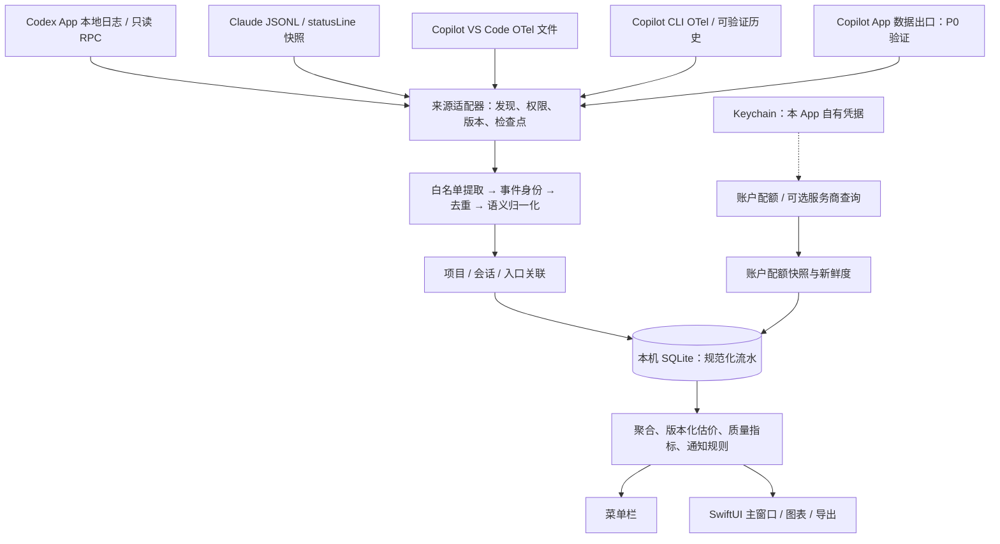

# Usage Tracking · 系统分析与实施规划

Author: Zeno Ren

> 本文件保留构建前的规划与研究。Usage Tracking 0.1 已开始实现，当前交付与限制见 [构建记录](BUILD_STATUS.md) 和 [README](../README.md)。

版本：0.1 · 研究日期：2026-09-09 · 状态：分析与设计，尚未实施

## 1. 建议与范围

建议开发一个原生 macOS 应用，以“菜单栏快速看额度 + 主窗口分析项目投入”为核心。最值得投入的部分是跨入口的数据准确性：同一个项目用了哪些工具、各花多少 Token、是否接近额度、数据覆盖到哪里，以及哪些金额只是估算。

用户已确认首版为个人单机、数据本地保存。实际覆盖五个入口：

| 工具 | 使用入口 | 首版定位 |
| --- | --- | --- |
| Codex | App | 本地项目、会话、Token 历史；按账户查询配额 |
| Claude Code | CLI | 本地 Token 历史、项目统计；通过官方 statusLine 获取额度快照 |
| GitHub Copilot | VS Code | 通过官方 OpenTelemetry 采集启用后的 agent/chat 用量 |
| GitHub Copilot | CLI | 通过官方 OpenTelemetry 采集；兼容可验证的本地历史记录 |
| GitHub Copilot | App | 账户额度共用；独立验证 App 的本地明细和遥测出口 |

三个 Copilot 入口共享同一账户时，账户额度只显示一份，项目消耗按入口分开。Copilot 内调用 Claude 模型的记录仍归属 Copilot，不能算到 Claude Code 账户。

默认支持 macOS 14+、Apple Silicon，后续按需求验证 Intel 构建。桌面优先，不规划手机适配。界面以中文为主，保留模型、Token、Credits 等准确原名。

首版不包含团队后台、云同步、其他电脑日志、账号自动切换、API 代理、模型路由、自动购买额度或强制中断其他工具。远程/云端任务仅在明细实际同步到本机或有受支持接口时计入，界面注明覆盖范围。

## 2. 必须先区分的四类数据

| 数据 | 回答的问题 | 单位与约束 |
| --- | --- | --- |
| 用量流水 | 本项目实际处理了多少内容？ | Input、Output、Cache Read、Cache Write、Reasoning Token，按来源口径归一化 |
| 账户配额 | 现在还能用多少，何时重置？ | 百分比、Credits、请求额度、账户/模型/周期；不能换算成统一 Token 余额 |
| 参考成本 | 如果按指定价格表计价，相当于多少钱？ | 带价格版本的估算金额；不等于订阅用户实际支出 |
| 账单与实扣 | 服务商实际记账多少？ | 服务商账单/实扣 Credits；与本地估算分表保存、独立展示 |

额外区分“上下文窗口占用”与“会话累计消耗”。压缩上下文后，占用可能下降，历史消耗不会因此减少。

**2026 年 Copilot 的计费变化必须纳入模型。** 当前 GitHub 文档以 Token 和模型成本折算 AI Credits；旧 Premium Requests 文档明确主要适用于 2026-06-01 后保留旧计费的特定年度 Pro/Pro+ 订阅。不能写死“每月 300/1,500 次”，应识别账户实际计费模式和返回的额度。AI Credits 的金额关系也不能反推唯一 Token 数，因为不同模型、缓存及计费政策不同。[O4][O5]

## 3. 四个参考项目如何使用

以下为固定提交的源码核查结果，具体路径见证据文档。

| 项目 | 已核实的能力 | 借鉴方式 | 边界及代价 |
| --- | --- | --- | --- |
| CodexBar | Swift 原生菜单栏；多服务商配额；Codex/Claude 本地成本扫描；Codex 项目与会话聚合；Copilot 内部 API、Credits 与部分 Token 计费兼容 | 首要工程参考：Provider 适配、刷新状态机、Mac 生命周期、Codex 去重及分叉处理 | 范围已很大；核心包包含广泛服务商与 Cookie 等依赖；不能把整个库当作很轻的三工具 SDK |
| token-tracker | Python 本地 CLI 报表；Claude/Codex/Kimi 解析；项目/模型/会话聚合；statusLine | 借鉴报表维度、用户理解方式、解析样例 | 不是 Mac 原生 UI；所查 Codex adapter 将整段累计量绑定会话开始时间；不能直接用于准确跨日报表 |
| usage-monitor | Python Mac 菜单栏、Windows/Web；Claude statusLine；Codex 日志和 app-server 配额回退 | 借鉴无需 Cookie 的额度桥接、空数据/过期数据呈现 | README 的“纯本地不调用 API”没有完整描述当前 app-server 路径；需按实际源码判断联网行为 |
| coding-tool | Node/Web 会话、项目浏览；Claude/Codex/Gemini；代理流量的实时 Token 统计 | 借鉴项目→会话的信息组织与可视化交互 | 代理统计只覆盖经其代理的请求；没有核实到目标 Copilot 三入口采集；代理与渠道管理超出本产品范围 |

四个项目顶层均为 MIT，可在保留原版权和许可的条件下复用代码；实际采用的依赖、vendored 子目录仍需单独审核。Author: Zeno Ren 不能替代上游作者与许可声明。

### 3.1 自建、Fork 与复用决策

| 路线 | 适合情况 | 评估 |
| --- | --- | --- |
| 直接使用已安装的 CodexBar | 主要想查看三家账户额度和现有统计 | 即刻可用，也是本产品应比较的基准；其账户可用性尚未登录实测 |
| Fork CodexBar，增加跨入口项目分析 | 追求尽快继承成熟 Mac 功能，能接受长期跟踪上游 | 可选；先做小规模修改试验，评估 UI/核心耦合与升级冲突 |
| 独立 Swift App，选择性移植适配器和测试思路 | 核心是五入口统一流水、项目归属、透明的数据覆盖 | **推荐**；避免把复杂 Provider UI、Cookie 和代理能力一并引入 |
| Tauri / Electron | 未来明确需要跨平台、已有 Web 团队 | 本轮目标为单机 Mac，暂不优先；文件采集和菜单栏仍需原生桥接 |

P0 中保留半天至一天的 CodexBar 复用验证：若可清晰抽取稳定接口则固定 revision 复用；否则移植必要模块并保留来源。Python/Node 参考项目用于理解行为，不要求用户安装这些运行时来使用成品。

## 4. 采集能力与证据强度

“官方支持”表示文档存在；“本机观察”仅表示在有限样本中见到字段；两者都不等于五入口已完成端到端验收。

| 入口/目标 | 首选数据源 | 可提供 | 证据状态 | 缺口与降级 |
| --- | --- | --- | --- | --- |
| Codex App 历史 | 实际配置的 CODEX_HOME 下 rollout / archived rollout；优先有响应 ID 的用量事件 | Token 分类、模型、项目 cwd、会话/turn、部分来源与时间 | 本机样本观察到 token_usage_record 和 token_count | App 的实际 home 与版本需发现；云任务、删失历史、私有格式变更可能缺漏 |
| Codex 账户 | 本地 codex app-server 的 account/rateLimits/read；探测 account/usage/read 支持情况 | 窗口额度；部分服务认证下账户 Token 活动/每日汇总 | 当前官方文档确认；本机尚未调用 | CLI 与 App 版本可不同；API-key-only 不支持该账户活动接口；失败时显示最后快照与时间 |
| Claude CLI 历史 | CLAUDE_CONFIG_DIR / projects 下 JSONL | 请求 Token、缓存、模型、cwd、会话时间 | 本机样本观察到 usage 字段 | transcript 是内部格式；流式修订、子代理、模型切换需要版本化解析 |
| Claude CLI 配额 | 官方 statusLine 的 rate_limits 等白名单字段，保存每会话快照 | 5h/7d 额度、重置时间、上下文、CLI 报告成本 | 官方文档确认；未安装本产品桥接 | 无活跃会话时可能不更新；字段不存在/非订阅账户时不显示伪零值 |
| Copilot VS Code | 官方 OTel file exporter；只消费 chat 调用明细 | Input/Output/缓存/Reasoning（有值时）、模型、耗时、会话、Git 仓库属性 | 当前官方文档确认；本机 VS Code 已安装，遥测未验收 | 只覆盖启用后的受支持 agent/chat 路径；不能据此承诺所有 Tab 补全；多根/非 Git 项目需映射 |
| Copilot CLI | 官方 OTel JSONL exporter；已有 session-state 仅作为经验证的补充 | Token、模型、调用时长、conversation ID；nano_aiu 等源字段 | 官方文档确认；本机最近三个历史文件仅见 session.start | 不能把空会话推论为 CLI 不支持 Token；启用前历史可能无法恢复 |
| Copilot App | 独立验证设置、日志或嵌入运行时的 OTel；有相同 response/trace 身份时与 CLI 去重 | 验证通过后提供 App 项目/会话明细 | 已确认本机 GitHub Copilot App；未确认数据出口 | 不能因 CLI 有 OTel 就推断 App 自动继承；未打通时仅展示同账户额度和明细缺失状态 |
| Copilot 账户 | 官方可用个人账单/用量接口或导出优先；CodexBar 同类内部 API 为可选适配 | Credits/请求额度/计划/周期，取决于账户实际响应 | 内部 API 的读取与解析已源码核实；未对本机账户验证 | copilot_internal/user 非稳定公开契约；OAuth 应用权限兼容性需验证；有额度不代表有项目明细 |

账户汇总与本地流水用于对照，不互相相加。账户还可能包含其他设备、云任务或未采集入口，因此不把两者差异自动视为解析错误，也不按比例把差额分摊到本地项目。

### 4.1 Codex App

- 先发现 App 真正使用的数据目录与版本，再读取日志。不能因 shell 中 codex 为某个版本，就认为 App 使用相同运行时。
- 本机抽样看到 token_usage_record 含 response_id、thread_id、turn_id、root_turn_id、usage、turn_token_usage、thread_token_usage。这是比仅扫描最后一个 token_count 更有用的流水候选。
- 优先采用经 fixture 验证的单响应 usage；累计快照作为校验/旧版回退。不能把三层用量再相加。
- thread/tokenUsage/updated 是活动线程通知，不是监听所有独立 App 进程的全局总线。启动一个新的 app-server 不保证能收到其他 App 的全部实时事件。[O1]
- account/usage/read 可作为账户层补充，字段允许 null，且需要支持的服务认证；不替代本地项目流水。[O1]

### 4.2 Claude Code CLI

- 历史统计从 transcript 中提取必要字段；官方说明 transcript 格式属于内部实现，必须按版本兼容。[O3]
- statusLine 提供额度和上下文快照；当前官方文档将 context_window.total_input_tokens 等描述为当前上下文信息，不能凭字段名 total 当作生命周期总消耗。[O2]
- 桥接必须保留原有 statusLine：先展示具体配置差异，备份原值，受控转发相同 stdin，保持原 stdout；失败不阻塞 Claude。
- 每个 session 独立快照，采用原子写入；额度按可靠账户身份合并。缺身份时按 source profile 隔离，不用“最近文件”猜账号。
- 可选的 Claude OTel 作为后续实时细节源；如果用户已有遥测，不覆盖原 exporter。重复来源通过同一事件身份核对。

### 4.3 GitHub Copilot VS Code / CLI / App

- VS Code 和 CLI 均有官方本地文件遥测路径，首选文件方式；当前阶段无需部署 Prometheus、Grafana 或本地 HTTP 服务。[O6][O7]
- 关闭内容捕获，只接收计数、时刻、模型、会话、必要项目属性。远程 URL 即便来自元数据也可能含凭据，需去 userinfo、query 并脱敏。
- OTel 的父 invoke_agent 和子 chat 都可能含累计 Token；Token 流水只计入去重的 chat 调用层，父节点用于校验和项目元数据关联。
- CLI 文档明确：统计 AI unit 消耗时读取根 invoke_agent 的 nano_aiu，不能把所有父子 span 相加；github.copilot.cost 是模型计费倍率，**不是美元金额**。nano AIU 保留原单位，在缺少可核实转换契约时不标成 Credits。[O6]
- VS Code 的 session.id 是窗口级身份；gen_ai.conversation.id 是会话身份；不能互换。根 span 的 Git 仓库属性可传递到同 trace 的 chat 调用。[O7]
- App/CLI/VS Code 可能复用底层 agent 或会话，入口与采集源要分开建模；不能按“文件来自哪里”重复记三笔。
- 若 App 无公开或可靠本地出口，首版可发布带“App 明细待支持”的预览版；在五入口都通过真实采集验证前，不宣称完整支持用户要求。

## 5. 功能地图与优先级

| 能力 | 第一阶段可用版 | 后续增强 |
| --- | --- | --- |
| 菜单栏 | 三家账户卡片；窗口/余额；重置；更新时间；异常标识 | 可配置最紧张账户、桌面 Widget |
| 总览 | 今日/7天/30天已观测 Token；参考成本；项目 Top；入口覆盖情况 | 自定义周期、趋势对比 |
| 项目分析 | 跨工具合并；按模型/入口/日期拆分；项目别名和未归属区 | monorepo 子项目、标签、项目预算 |
| 会话分析 | 会话/turn 时间线、模型变化、Token 分类、主/子任务关系 | 已确认的状态通知、跳转原工具 |
| 成本 | 版本化价格表、未知价格提示、参考成本与服务报告成本分开 | 用户导入账单、订阅分摊视图、价格变更重算 |
| 账户额度 | 三工具实际可取的配额；Copilot 新旧计费模式适配 | 可选多 profile 支持、真实账单对照 |
| 通知 | 额度阈值跨越、采集长期异常；冷却和合并 | 有足够有效样本后提供趋势预测 |
| 数据质量 | 新鲜度、缺失原因、解析错误、价格/项目覆盖率 | 来源冲突定位、可导出的诊断摘要 |
| 导出 | CSV/JSON，默认脱敏、带计量说明和作者 | 自包含 HTML 周报 |
| 设置 | 数据源向导、权限范围、暂停、开机启动、保留周期 | 高级 profile 和价格维护 |

### 5.1 界面信息架构

**菜单栏：** 一次点击回答“哪家快用完、何时重置、数据新不新”。没有可靠配额时显示“未提供/待刷新”，不能显示健康的 0%。额度单位与窗口直接可见。

**主窗口侧栏：** 总览 / 项目 / 会话 / 账户额度 / 成本 / 数据源与诊断 / 设置。

**项目详情：** 项目名称 → 时间范围 → 已观测总量 → 工具/模型分布 → 会话列表 → 数据覆盖说明。打开某个数值能看到计量口径、来源、时间和是否估算。默认不展示聊天正文。

**首次启动：** 发现实际安装和目录 → 列出各入口能读到的字段 → 用户启用所需来源 → 展示 statusLine/OTel 的具体配置差异 → 执行可恢复修改 → 使用一段真实使用记录验证 → 展示可用/部分/未连接。不会仅因应用已安装就显示“连接成功”。

### 5.2 具体用户故事

1. 我开始写代码前，看三家配额及最早重置时间。
2. 我想知道本周 Project A 在 Codex、Claude Code、Copilot 各消耗多少，并能区分 Copilot 的 VS Code 与 App。
3. 某天成本突然增加，我能下钻到模型、会话和调用，看到是缓存下降、输出增加还是价格变化。
4. 数据突然为零时，我能看出是没有使用、权限断开、遥测未启用，还是源格式不兼容。
5. 我只想导出某个项目的用量，不把用户名、绝对路径和提示词一起发出去。

## 6. 技术架构

推荐 Swift 6 + SwiftUI + AppKit + Swift Charts + SQLite/GRDB。使用 Swift Package 划分纯领域逻辑与 macOS 交互；GRDB 等新增依赖在实施时固定版本并审核许可。普通单机查询无需独立服务端、向量数据库或 LLM。

该图只包含规划组件；Copilot App 的箭头不表示已打通。

| 模块 | 责任 |
| --- | --- |
| MonitorDomain | 计量口径、流水身份、配额状态、金额类型、质量状态；纯函数优先 |
| SourceAdapters | Codex、Claude、Copilot 各版本解析；只读源文件；能力探测 |
| Ingestion | 文件增量、偏移检查点、修订、幂等、源优先级、错误隔离 |
| ProjectResolver | cwd / Git common-dir / 仓库属性 / 人工规则，保留映射来源 |
| MonitorStore | SQLite 事务、索引、迁移、聚合、保留与重建 |
| QuotaService | 同账户独立窗口、受限联网查询、缓存、重置与过期状态 |
| CostEngine | 有效期价格、缓存分类、未知模型、参考成本及服务报告金额 |
| MacIntegration | 菜单栏、开机启动、通知、文件选择、Keychain、后台生命周期 |
| MonitorUI | 查询模型、筛选、图表、详情、质量说明 |

采集调度使用 actor 隔离；UI 更新在 MainActor；限制同时扫描文件数与每轮字节数，取消任务可在检查点停止。P0 不引入可动态执行任意第三方代码的插件系统。

### 6.1 关键数据实体

| 实体 | 关键字段/关系 |
| --- | --- |
| ProviderAccount | service、issuer/host、account/workspace ID、identityConfidence；源未知时可空 |
| SourceInstance | tool、surface、home/profile、app/CLI version、parserVersion、capabilities、consentScope |
| Session / Turn | source session ID、parent/fork/root turn、开始/结束、项目关联；源状态与推断状态分开 |
| UsageEvent | source event/response/trace-span ID、eventTime、observedAt、account、surface、session/turn、model、Token 分类、计量语义、revision、quality |
| QuotaSnapshot | account、limit ID、scope、unit、used/limit/remaining、window、resetsAt、capturedAt、freshness |
| BillingObservation | 原始单位与金额、currency、billingMode、period、来源、是否服务商实扣 |
| Project / ProjectAlias | 稳定 project ID、canonical root、Git common-dir、来源路径、手工映射有效时间 |
| PriceRate / CostEstimate | model 精确 ID、service、tier、region（适用时）、分类单价、有效期、priceVersion、推定说明 |
| IngestionCheckpoint | file identity、generation、byte offset、最后完整行、parserVersion，与流水同事务提交 |
| SourceHealth | 最后成功、最新事件、解析错误计数、缺失字段、覆盖起点、恢复动作 |

数字未知使用 null；源明确返回 0 才显示 0。无限额度使用独立状态，不能以“0/0”构造百分比。账户配额 key 包含账户、workspace、模型池和周期，不以 email/显示名作为唯一标识。

身份分层：使用工具是 Copilot、消费账户是 GitHub、底层模型提供方可能是 Anthropic/OpenAI；这三项分开保存。

## 7. 准确性规则：产品的核心

### 7.1 Token 计量

- **Claude：** 常见 transcript 下，input_tokens、cache_read_input_tokens、cache_creation_input_tokens 是不同输入部分。按明确契约汇总；cache_creation 子分类是总量拆分时只计一次。
- **Codex：** 常见记录的 input_tokens 已包含 cached_input_tokens；不能再加一遍缓存命中。reasoning_output_tokens 通常是 output_tokens 的子集；本机又出现 cache_write_input_tokens，必须用当前版本样本验证其包含关系，不套用旧版公式。
- **Copilot：** 根据 exporter/版本的 GenAI 字段语义转换；仅字段名称相同不足以证明缓存是否已包含。保留原始计数字段的白名单副本，验证后再转换到统一输入分类。
- 统一内部分类建议为 uncachedInput、cacheReadInput、cacheWriteInput、output、reasoningSubset；同一计量规范验证通过后才能合计。暂不能确定包含关系时保留 nativeTotal 和“不完全可比”标识。
- Token 总量展示的是已观测模型处理量，不代表代码产出、任务难度或工具效率。

### 7.2 去重、修订与分叉

1. 单响应 ID/trace+span 优先；完整事件才提交，遇到半行等下一次读取。
2. 同一请求的流式片段、usage 修订和最终结果更新同一条逻辑流水；不能只取第一条，也不能每个片段加一遍。
3. Codex 新响应事件与旧累计快照不叠加；OTel chat 与父 invoke_agent 不叠加；OTel histogram 也不再累加到请求流水。
4. 分叉继承的父会话历史只计一次，新的实际模型请求应计入。按响应身份或可验证分叉基线处理；父记录缺失且无法确定基线时标记未解析覆盖，不能盲目把全部继承量当新消耗。
5. subagent / 多线程日志中可能交错不同累计序列，不能对整文件统一做差；以明确 session/thread/lineage 分组。
6. 累计值降低可能是重置、压缩、修订或不同 lineage。分段并记录原因；不要仅 max(差值,0) 后丢弃所有异常证据。
7. 同一 App 会话通过多个入口或导出源出现时，跨源去重必须依赖稳定身份。没有共同身份时选择一个权威来源，其他只作核验。
8. 文件偏移只能实现同文件幂等；跨文件复制、归档、改名还需要事件身份。确实无身份时以文件 generation+offset 作本地 key，并标注跨源去重限制。

### 7.3 时间与项目归属

- 以用量事件发生时间归账；不能把 23:50 开始、次日结束的会话总量全部记在第一天。
- 仅有稀疏累计快照时，增量发生在一个时间区间内；跨日无法精确拆分就标记时间归属近似，不按线性插值伪造精度。
- 时间以 UTC 保存，报表按用户时区转换；跨夏令时、时区切换和重放都要一致。
- 默认按真实 cwd 和 Git common-dir 合并同仓库 worktree，保留工作区子维度。不要只用目录 basename，不从编码目录名不可逆地猜完整路径。
- Git remote URL 是关联候选，不能把所有同 remote 的独立 clone 自动合为一项目。人工确认的别名规则可覆盖自动结果。
- VS Code multi-root、非 Git、无 cwd 和来源仅有仓库属性时，显示仓库级或未归属，不把前台窗口当成可靠项目证据。
- 一个会话跨多个项目工作时，缺少逐调用工作目录则只能做会话级归属；若未来支持人工分摊，必须标明规则及有效期。

### 7.4 成本与覆盖

参考成本 = 各互斥 Token 分类 × 对应价格 / 1,000,000；按模型、实际服务、价格有效期与 tier 选择价格。Cache Write 如有 5m/1h 费率区分则分别计价。工具调用费、请求费等仅在有明确数据时单列。

- 不自动把未知模型套用“同系列”价格；显示未定价 Token 与价格覆盖率。用户可指定价格，但标为用户配置。
- 不把 Claude statusLine 的 cost、Codex 本地估价或 Copilot github.copilot.cost 当成银行实际支出。
- 不把订阅费 + API 等效金额相加为总账单。订阅分摊只能作为显式分析规则，单独显示。
- 以价格版本生成可复算的 Estimate；更新价格表不静默重写历史。
- “项目归属率”= 有项目归属的已观测 Token / 已观测 Token；“价格覆盖率”也以已观测量为分母。不能称为账户全部用量覆盖率。
- 账户配额与本地用量的时间范围和单位不同，仅在范围、账户、单位都一致时做对照，始终保留差异原因。

## 8. 本地性、权限与可靠性

“数据保存在本机”不等于完全断网：历史解析、项目查询和图表可离线；用户启用账户配额查询、价格更新、应用更新时会连接对应服务。提供离线模式，界面区分本地事件与远程快照。

### 8.1 最小数据采集

- 源日志读取过程中只提取白名单元数据，不复制完整 transcript、提示词、代码或工具参数到数据库。
- 不自动读取浏览器 Cookie 或其他应用的凭据库。Claude 优先 statusLine；Codex 优先自身 app-server；Copilot 内部 API 作为单独可选连接能力。
- 若需要本产品自己的 GitHub OAuth 应用，独立注册和验证权限；不能照搬其他项目的 client ID 并假定可访问 Copilot 内部端点。密码/令牌不会进入分析文档、调试日志或导出。
- 自有凭据使用 Keychain，数据文件限制当前用户访问。SQLite 默认并非数据库级加密，使用 OS 文件权限与 FileVault；需要更高隔离时再评估 SQLCipher。
- 先选择数据目录，再申请相应文件读取权限；首版无需屏幕录制、辅助功能或默认 Full Disk Access。
- 用户项目文件中的文本、日志内容和 repo URL 都视为不可信数据，不执行其中指令；导出时 HTML 转义，CSV 防公式注入。

### 8.2 持久化和调度

- 存储建议：~/Library/Application Support/Usage Tracking/。配置、规范化数据库、桥接快照、源游标分目录。
- 外部数据库仅用只读方式；不能修改 Codex/Claude/Copilot 的 DB，也不能破坏其 WAL 锁。对于可能产生 sidecar 的读取方式在 P0 验证，优先受支持接口或安全快照。
- 本产品 SQLite 使用 WAL、单写 actor、事务内同时提交事件与检查点；重启可重放，数据库损坏可从仍可用的源重新构建。
- FSEvents/文件变化通知作触发，并用低频增量核对补偿丢失事件；禁止每秒全目录递归扫描。
- 活跃变化合并 0.5–2 秒；安静时低频核对；配额默认约 5 分钟查询，手动刷新仍限速。睡眠停止后台查询，唤醒抖动后补采；429 遵从 Retry-After 和指数退避。
- 单个适配器超时或格式错误不影响其他工具。关闭主窗口仍可在菜单栏运行；完全退出后不采集，重新启动尝试从源补齐。
- app-server 子进程具有超时、输出大小上限和明确回收；不创建或提交模型任务。需验证其初始化是否触发插件/凭据刷新及副作用。
- 默认保留 90 天明细、长期日汇总，可配置。源日志和价格版本缺失后不能承诺完整历史重算；由保留策略说明限制。

### 8.3 配额、通知与故障状态

状态至少包括：未发现、未启用、已连接、部分数据、过期、权限不足、需重新登录、格式不兼容、暂时失败。更新时间和最新事件时间分别显示。

配额过重置时刻不直接显示 0%；显示“等待新窗口数据”。同账户、同窗口的最后有效值可作历史参考，不能把其他账号的新快照覆盖进来。

通知以 70/90/100% 等用户可调阈值跨越触发；只对新鲜可靠数据发额度提醒，按账户+窗口去重、冷却，重置确认后重新布防。当前采集没有证据时不承诺“等待审批/任务完成”实时提醒；推测状态必须带标识。

### 8.4 发布方式

首版走直接分发 .app / .dmg，采用 Developer ID 签名与 notarization；开发阶段可本地签名验证。Mac App Store 的沙箱与跨工具目录读取需要独立论证，不作为第一版发布前提。开机启动用 SMAppService；自动更新可选 Sparkle，启用前配置更新签名与发布管道。作者标识放在 About、README 和导出报告中，上游许可保留在 Third-Party Notices。

## 9. 分阶段实施与退出标准

以下是单名熟悉 Swift/macOS 的工程师的粗估，包含正常开发和验证，不是已测工期；外部接口、账号权限和 App 私有格式会影响时间。

| 阶段 | 预计投入 | 主要产物 | 必须满足的退出标准 |
| --- | --- | --- | --- |
| P0 数据可行性 | 3–5 工作日 | 五入口能力探测、脱敏 fixture、数据字段契约、CodexBar 复用验证、连接方案 | Codex/Claude 真实记录可解析；Copilot VS Code/CLI 各一段真实遥测能对账；Copilot App 出口得到“可采/有限/不可采”的证据；明确各账户配额可用性 |
| P1 本地流水与项目 | 5–8 工作日 | Swift Package、增量索引、SQLite、来源诊断、项目/会话聚合 | 重新导入不增量；跨日正确；新旧格式不双计；worktree 可合并、未知项目可见；断电/中断恢复无遗漏 |
| P2 Mac 可用版 | 5–8 工作日 | 菜单栏、总览、项目、会话、成本、账户额度、设置与通知 | 主窗口关闭继续采集；数据新鲜度真实；连接配置可回退；支持入口在正常使用时能持续更新 |
| P3 五入口与发布验收 | 3–5 工作日 | 兼容修正、App 适配收尾、性能结果、签名包、用户说明 | 用户五入口逐一有验收结果；若 App 明细仍不可采，只发布显式降级预览；稳定运行、脱敏导出、清理本产品数据不影响源工具 |

合计约 16–26 工作日，即约 3–5 个工作周。P0 后重新估算；不能以完成漂亮界面替代五入口数据验证。

### 9.1 最先实施的顺序

1. 先做 Codex App 的单响应流水、重复与跨日 fixture；本机已有最有价值的样本。
2. 同步安排到同一 P0 工作序列中验证 Copilot App 和 VS Code/CLI OTel，尽早暴露最大不确定性，不等 UI 完成。
3. 完成 Claude 历史解析与不破坏现有 statusLine 的桥接。
4. 三工具进入同一项目账本后，再开发成本/额度总览和菜单栏。
5. 最后补通知、性能与分发。每一步保留可运行的最小纵向切片。

### 9.2 非功能验收目标

以下为拟定目标，尚未测量：

| 指标 | 目标与测试条件 |
| --- | --- |
| 正确性 | 脱敏金标准 fixture 的计数、去重和归账完全一致；缺失信息被显式标记 |
| 增量延迟 | 文件写入完整记录后 p95 ≤ 5 秒；不包含源 exporter 自身缓冲时间 |
| 查询体验 | 100 万条规范化事件、90 天常用聚合查询 p95 ≤ 300ms，记录机器与索引配置 |
| 资源 | Apple Silicon 上闲置 CPU 平均 < 1%，稳态 RSS 目标 < 200MB，导入时单独测峰值 |
| 初次导入 | 流式处理 1GB 合成日志，进度可见/可取消/可恢复，先报告实测吞吐，不预设虚假秒数 |
| 持续运行 | 72 小时正常使用 + 睡眠唤醒、断网恢复、文件轮转；无持续增长和重复统计 |
| 数据安全 | 日志/数据库/导出中无原始提示词或凭据；仅本产品自有目录可清理 |

## 10. TDD 与 Tidy First 实施策略

本轮只做规划，不给文档编写与实现镜像的测试。进入开发后，优先针对数据错误的可观察行为建立测试；每个适配器按 Red → Green → Refactor 开发。

先建立最小脱敏 fixture 和预期账本，再写解析器，不边解析边“猜测正确结果”。结构整理与行为变更分开提交；先消除必要的耦合，再增加功能，不预先搭建复杂框架。

必须覆盖的验收案例：

| 类型 | 具体案例 |
| --- | --- |
| Codex | 同一 response 同时出现在 token_usage_record/token_count 只计一次；缓存/Reasoning 不重复；交错线程独立差分 |
| 分叉 | 父 100、分叉继承 100、子新增 20，总量 120；缺父基线时不伪造准确值 |
| Claude | 同 request/message 的 usage 多次修订，只保留最终有效计量；cache creation 总量与子分类不双计 |
| Copilot | 两个 chat 各 10/20，父总量 30，最终为 30；AI unit 按根节点规则独立处理 |
| 跨源 | App/CLI 共同 response 或同 trace 重放不增量；无稳定 ID 时保留明确权威源选择 |
| 时间 | 23:59 与 00:01 两次请求分到两天；时区变更只改变视图分桶；稀疏累计跨日标近似 |
| 文件 | 半行、坏行、追加、轮转、截断、搬移、归档、不同路径重复副本；重启重复导入总量不变 |
| 项目 | 同名不同根不合并；worktree 合并；symlink 去重；multi-root/无 Git 保持未归属或已确认规则 |
| 配额 | null 不变 0；无限不渲染 0/0；重置到期不假清零；同 email 不同 workspace 不串数 |
| 价格 | 未知模型显示未定价；缓存 tier 和价格日期正确；订阅费不与等效成本重复求和 |
| 恢复 | 插入事件与游标更新之间强制终止，重启后无漏无重；迁移失败不破坏可恢复数据库 |
| Mac 集成 | statusLine 原输出不变、失败不阻塞、配置精确回退；窗口关闭、睡眠、权限撤回与通知冷却 |
| 隐私 | export 白名单、HTML 转义、CSV 公式防护；源 payload 中的提示词和令牌不进入持久化 |

最终以每个真实入口的一次正常会话，对照工具原生显示与本产品流水；明确误差来自采集、时间边界、模型计价还是源统计口径。

## 11. 当前已确认与仍需解决的事项

已确认：范围为个人单机五入口；工作区目前没有应用代码；四个项目顶层 MIT；Mac/Swift 环境和相关工具存在；Codex/Claude 有可用字段样本；Copilot VS Code/CLI 有官方本地遥测路径。

尚未确认：本机 Codex App 实际运行时与支持的 RPC 版本；Claude 订阅配额字段在当前登录方式下的可用性；Copilot 账户计费模式与可访问接口；Copilot App 的本地采集出口；VS Code multi-root 的逐调用项目归属；历史日志保留与缺失范围。

这些缺口应通过 P0 技术验证回答；现在无需继续让用户做架构选择。当前最合理的下一步是建立数据探测和脱敏 fixture，再以事实决定完整版本承诺。

## 12. 参考来源

固定提交、源码定位、本机观察和文档核验范围见 [研究证据](RESEARCH_EVIDENCE.md)。

- [O1：OpenAI Codex App Server](https://learn.chatgpt.com/docs/app-server)
- [O2：Claude Code Status Line](https://code.claude.com/docs/en/statusline)
- [O3：Claude Code Monitoring](https://code.claude.com/docs/en/monitoring-usage)
- [O4：GitHub Copilot 个人用量计费](https://docs.github.com/en/copilot/concepts/billing/usage-based-billing-for-individuals)
- [O5：Copilot 旧请求计费](https://docs.github.com/en/copilot/reference/copilot-billing/request-based-billing-legacy/copilot-requests)
- [O6：Copilot CLI 命令与 OpenTelemetry](https://docs.github.com/en/copilot/reference/cli-command-reference)
- [O7：VS Code Agent OpenTelemetry](https://code.visualstudio.com/docs/agents/guides/monitoring-agents)
- [O8：GitHub Copilot App](https://docs.github.com/en/copilot/concepts/agents/github-copilot-app)
- [O9：Copilot Usage Metrics REST](https://docs.github.com/en/rest/copilot/copilot-usage-metrics)

Author: Zeno Ren
